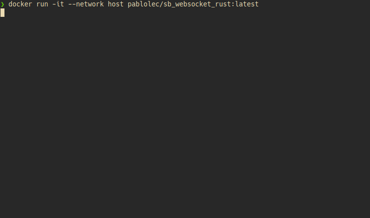

# sb_websocket_rust

## Overview
This project is a console-based chat interface that relies on WebSocket communication. 
One instance acts as a server if no existing server is found, while the other takes on the role of a client. 
The UI is created using [Ratatui](https://github.com/ratatui-org/ratatui).

## Demo
<p align="center">
  
</p>

## Instructions to Run
- Run two separate instances of the application using:
```
docker run -it --network host pablolec/sb_websocket_rust:latest
```
- Once both instances are up and connected, type your message, press <kbd>Enter</kbd> to send, and <kbd>Esc</kbd> to exit the application.

## Enhancements
- The WebSocket implementation currently uses only the standard library and thus covers only a small part of [RFC 6455](https://tools.ietf.org/html/rfc6455). For example, there is currently no solution to gracefully shut down the connection.
- The application currently operates intentionally only on localhost. An area for improvement would be to display an initial screen with the option to select the host and port to connect to.
- The UI can obviously be improved, for instance, by adding metadata (users, timestamps of messages) or by offering the possibility to scroll through messages.
